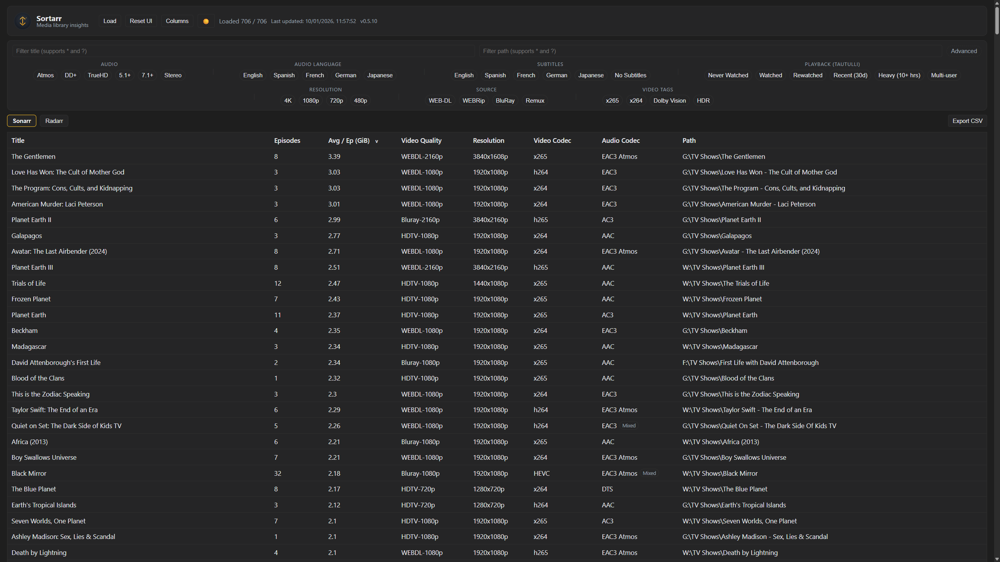
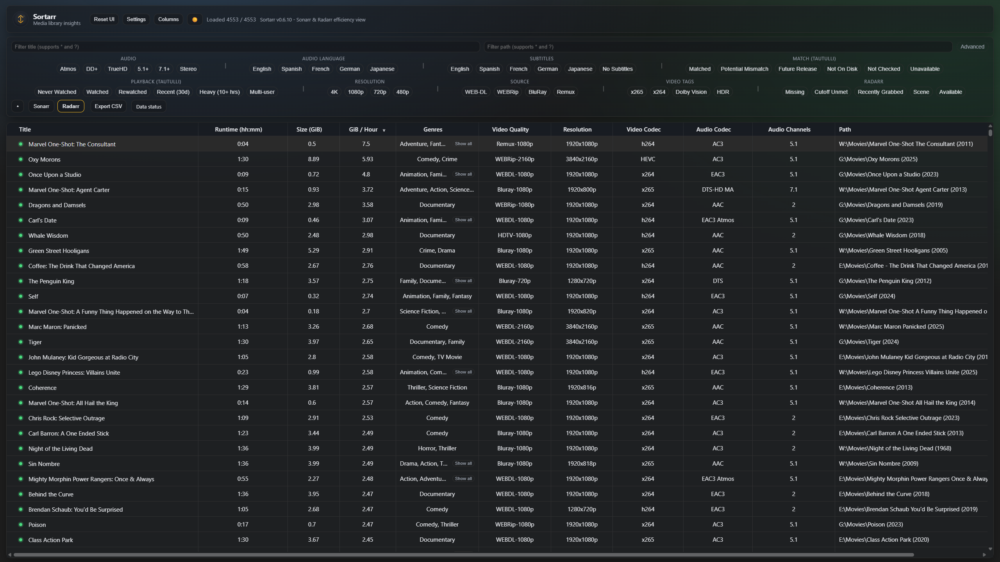

# Sortarr


Sortarr is a read-only analytics and organisation tool for Sonarr and Radarr libraries. It helps you identify missing media, mismatches, and optimisation opportunities using real playback data from providers like Tautulli, Jellystat, or Plex.

Sortarr provides a data-driven management layer for your media library, using optional playback behaviour data to help you to optimise your library.

Sortarr does not modify, move, or rename your media. It can analyse Sonarr and Radarr libraries, or use Plex directly as a media source, and incorporates playback and history data to present actionable insights.

---

## Key capabilities

* Analyse Sonarr and Radarr libraries in a unified interface
* Integrate playback history from Tautulli, Jellystat, or Plex
* Identify missing media, mismatches, and optimisation opportunities
* Support multiple Sonarr and Radarr instances
* Fully read-only operation for safety

---

## Who this is for

Sortarr is designed for users who:

* Use Plex, Sonarr, Radarr, Tautulli, or Jellystat
* Want data-driven insight into their library
* Manage medium to large collections

---

## Screenshots

### Shows View:

### Movies View:


---

## Quick start

Supports Docker, Unraid, Linux, Windows, and NAS environments.

### Docker


Create a `docker-compose.yml`:

```yaml
services:
  sortarr:
    image: ghcr.io/jaredharper1/sortarr:latest
    container_name: sortarr
    ports:
      - "9595:8787"
    volumes:
      - ./config:/config
    restart: unless-stopped
```

Start Sortarr:

```bash
docker compose up -d
```

Access the web interface:

```
http://localhost:9595
```

---

### Unraid

Sortarr can be installed on Unraid using the included template file.

### Install using the provided template:

1. Open the Unraid web interface

2. Go to the Docker tab

3. Click Add Container

4. Switch to Advanced View

5. Open the template dropdown and select User Templates

6. Import or paste the contents of [docs/unraid-template.xml](https://raw.githubusercontent.com/Jaredharper1/Sortarr/refs/heads/main/docs/unraid-template.xml)

8. Configure the /config path to a persistent appdata location (recommended: /mnt/user/appdata/sortarr)

9. Apply and start the container

Access the web interface:

```
http://<unraid-ip>:9595
```

Your configuration will persist in the configured appdata directory.

Community Applications support is coming soon.

Detailed Unraid configuration coming to the [Wiki](https://github.com/Jaredharper1/Sortarr/wiki) soon.

---
## Initial setup

When you first open Sortarr, for an ideal setup:

1. Add your Sonarr and/or Radarr instances
2. Add at least one history provider (Tautulli, Jellystat, or Plex)
3. Add one playback provider (current only Plex is supported, with Jellyfin and Emby support coming soon!)
4. Test connections, then Save configuration.

Sortarr will begin analysing your libraries immediately, and display a PowerBI like spreadsheet with helpful tools to help you spot outliers and issues.

---

## Documentation

Full documentation is coming soon in the Wiki:

* Installation guides
* Configuration reference
* Provider setup (Sonarr, Radarr, Tautulli, Jellystat, Plex)
* Reverse proxy configuration
* Troubleshooting and diagnostics

Open the Wiki:
[https://github.com/Jaredharper1/Sortarr/wiki](https://github.com/Jaredharper1/Sortarr/wiki)

---

## Supported providers

### Media sources

* Sonarr
* Radarr
* Plex

### History providers

* Tautulli
* Jellystat
* Plex

### Playback providers

* Plex
* Emby and Jellyfin support coming soon!

---

## NOTE

### Reverse proxy / HTTPS (Traefik, Nginx, Cloudflare, etc.)

Sortarr can be run behind a reverse proxy. In that case it may need to trust X-Forwarded-* headers so Flask correctly detects the external scheme/host (for example https://sortarr.mydomain.com). 

If this is not set correctly, you may see errors like "CSRF origin mismatch" during setup when accessing Sortarr via HTTPS through a proxy.

```
SORTARR_PROXY_HOPS (optional)
```
Typical values:
```
0 Disabled
1 Single proxy (default)
2 Double proxy (e.g., Cloudflare Tunnel → Traefik → Sortarr)
```
Security note: If SORTARR_PROXY_HOPS is enabled, make sure Sortarr is only reachable through your reverse proxy. (Do not publish the Sortarr container port directly to the internet).

---

## What Sortarr does NOT do

Sortarr will never:

* Modify or rename media files
* Delete media
* Change Sonarr or Radarr configuration
* Trigger downloads automatically

All operations are read-only and safe.

---

## Security and safety

Sortarr is strictly read-only. It does not modify media files or change Sonarr/Radarr configuration.

---

## License

[MIT License](https://github.com/Jaredharper1/Sortarr/blob/main/LICENSE)
